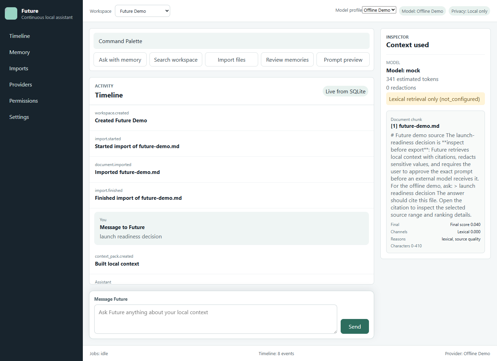

# Future

[](https://github.com/pranavdhawann/singularity/actions/workflows/ci.yml)
[](LICENSE)
[](https://github.com/pranavdhawann/singularity/releases/tag/v0.1.0)

**Future is the local memory and permission layer for AI assistants—import your history, retrieve cited context, and approve exactly what leaves your machine.**

The first wedge is simple: import your ChatGPT history and project files into a private, cited, model-agnostic assistant. Use an offline demo, a local Ollama model, or an OpenAI-compatible provider without giving one model vendor ownership of your memory.

> **Release status:** `v0.1.0` is an early but functional local-first release for technical early adopters. It is not production-ready and does not yet include packaging, encrypted local storage, cloud sync, or multi-user isolation.



## Why Future?

Most assistants hide the context they selected, scatter useful history across chats, and make external data sharing hard to audit. Future keeps the durable layer on your machine:

- **Inspectable memory:** review, edit, pin, outdate, namespace, or delete memory.
- **Cited retrieval:** every stored source used by an answer can be opened with its range and ranking explanation.
- **Model-agnostic runtime:** use the offline mock, Ollama, or an OpenAI-compatible endpoint.
- **Redaction before approval:** Future builds and redacts the complete prompt locally.
- **Explicit external permission:** an external call cannot run until you approve the exact immutable prompt preview.
- **Durable audit trail:** imports, model calls, approvals, denials, failures, cancellations, and answers live in one SQLite timeline.

Future does not autonomously send messages, modify external systems, create cloud accounts, or act on your behalf.

## 60-second local demo

Requirements: [Node.js 24+](https://nodejs.org/) with Corepack and Git.

```powershell
git clone https://github.com/pranavdhawann/singularity.git
cd singularity
corepack pnpm install --frozen-lockfile
corepack pnpm demo
```

Open `http://127.0.0.1:4173` and ask `launch readiness decision`. The demo uses a dedicated `.future/demo.sqlite` database, an offline deterministic model, and the bundled `examples/future-demo.md` source. Open the citation to inspect the exact selected range. Press `Ctrl+C` to stop it.

To exercise the unseeded setup and import your own `.md`, `.markdown`, `.txt`, or ChatGPT `.json` export instead:

```powershell
corepack pnpm dev
```

## Use a real model

### Simplest local path: Ollama

1. Install [Ollama](https://ollama.com/) and run `ollama pull llama3.2`.
2. Run `corepack pnpm dev`.
3. In first-run setup, choose **Ollama**, keep `http://127.0.0.1:11434`, and use model `llama3.2`.
4. Import a source, ask a question, and inspect the cited context. No external prompt approval is required because the endpoint is local.

### External OpenAI-compatible provider

Keep the key outside SQLite and start Future from the same shell:

```powershell
$env:FUTURE_OPENAI_API_KEY = "your-key"
corepack pnpm dev
```

In setup choose **OpenAI-compatible**, enter the provider base URL, use `FUTURE_OPENAI_API_KEY` as the secret environment variable, and choose the provider's model name. Future retrieves and redacts locally, pauses the turn, and shows the exact outbound prompt. Approve to continue or deny to prevent the call. Secret values, raw pre-redaction prompts, and provider response bodies are not written to timeline events.

## What works today

- first-run workspace, provider, and model-profile setup;
- one persistent assistant timeline with durable completion, failure, cancellation, and reload behavior;
- protected Markdown, text, and ChatGPT export imports with resumable per-file checkpoints;
- SQLite FTS5 retrieval plus optional Ollama or OpenAI-compatible embeddings;
- retrieval across document chunks, approved memory, prior events, and compactions;
- immutable context packs, normalized citations, source ranges, and ranking explanations;
- memory review, editing, pinning, lifecycle controls, namespaces, revisions, tombstones, and compaction;
- offline mock and Ollama generation plus streaming OpenAI-compatible chat completions;
- whole-prompt redaction and immutable approve/deny decisions for external calls;
- local session-token and browser-origin protection on V2 mutations;
- unit, integration, production-build, and browser acceptance coverage.

Legacy `/api` routes remain during migration; the connected browser uses protected `/api/v2` contracts.

## Privacy and security boundary

Future stores application data locally in `.future/future.sqlite` by default. Local mock and Ollama flows can run without sending prompt context to an external model. For an external profile:

1. retrieval and context assembly happen locally;
2. the entire prompt is redacted locally;
3. redaction failure blocks execution;
4. the user sees the provider, model, source list, exclusions, redactions, token estimate, and exact final prompt;
5. approval is bound to the turn, provider, profile, model, context-pack hash, and prompt hash;
6. changing a bound input invalidates the grant.

This early release does **not** encrypt the SQLite database at rest, sandbox imported files, or make the local machine a multi-user security boundary. Read [SECURITY.md](SECURITY.md) before using sensitive data.

## Architecture

```text
React command center
        │ protected local HTTP + SSE
        ▼
Fastify orchestration ── permission/redaction gate ──► Ollama or approved external provider
        │
        ├── importers ──► normalized documents/chunks
        ├── retrieval ──► FTS5 + optional embeddings ──► immutable context pack + citations
        └── SQLite ──► timeline, memory, imports, profiles, prompt decisions
```

The browser never talks to SQLite directly. Shared contracts live in `packages/core`; database, import, retrieval, provider, memory, and permission logic are separate workspace packages. See [Architecture](docs/architecture.md) and [Contributor roadmap](docs/contributor-roadmap.md).

## Roadmap

- **Now — hardening:** structured redacted logging, bounded background-job recovery, and opt-in proactive work that stays disabled by default.
- **Next — distribution:** desktop packaging and a smoother local model/setup experience.
- **Later, only with explicit designs:** sync, teams, connectors, and plugins.

Autonomous external actions and automatic provider-cost routing remain explicitly deferred. The detailed boundary is in [Next Steps](docs/12-next-steps.md).

## Contributing

Start with [CONTRIBUTING.md](CONTRIBUTING.md), the [contributor roadmap](docs/contributor-roadmap.md), and issues labeled [`good first issue`](https://github.com/pranavdhawann/singularity/labels/good%20first%20issue). Security reports belong in [GitHub private vulnerability reporting](https://github.com/pranavdhawann/singularity/security/advisories/new), not public issues.

Useful references:

- [Build runbook](docs/10-build-runbook.md)
- [Release checklist](docs/11-release-checklist.md)
- [Release process](docs/releasing.md)
- [Current project context](docs/context.md)
- [Changelog](CHANGELOG.md)

## Future and the `singularity` repository

**Future** is the product name. **singularity** is the current GitHub repository name from an earlier naming pass. Package scopes and user-facing copy use Future consistently. A repository rename may improve discovery later, but it is not part of `v0.1.0` and should only happen with explicit maintainer approval and redirect planning.

## License

[MIT](LICENSE)
