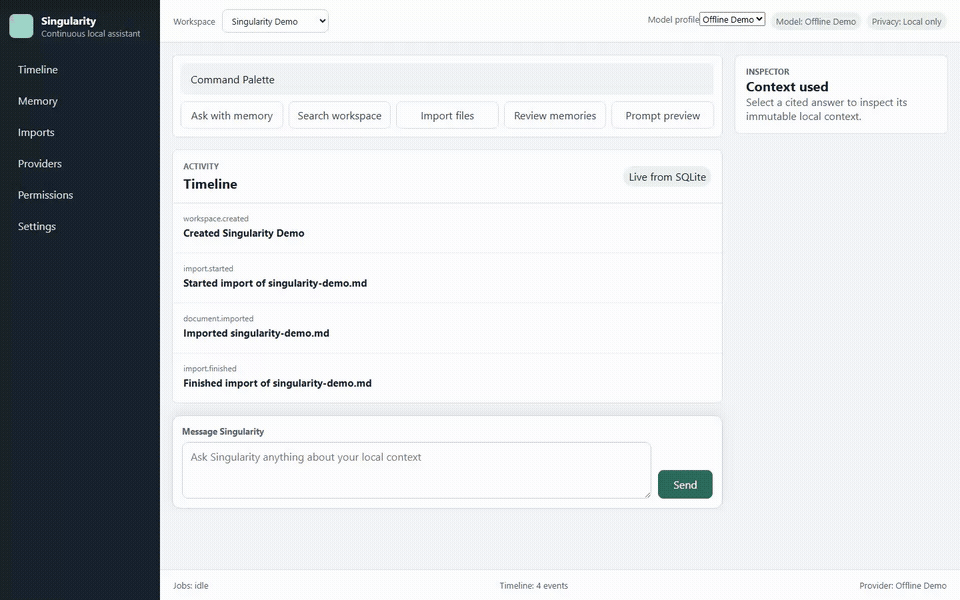

<div align="center">


### The local memory & permission layer for AI assistants

Import your history, retrieve **cited** context, and approve **exactly** what leaves your machine.

[](https://github.com/pranavdhawann/singularity/actions/workflows/ci.yml)
[](LICENSE)
[](https://github.com/pranavdhawann/singularity/releases/tag/v0.1.0)
[](https://nodejs.org/)
[](#-privacy--security-boundary)
[](CONTRIBUTING.md)

[**Quick start**](#-60-second-local-demo) · [**Features**](#-why-singularity) · [**Use a real model**](#-use-a-real-model) · [**Architecture**](#-architecture) · [**Roadmap**](#-roadmap) · [**Contributing**](#-contributing)

</div>

---

Singularity turns scattered chat history and project files into a private,
cited, model-agnostic assistant. Run the deterministic **offline demo**, plug in
a **local Ollama** model, or connect an **OpenAI-compatible** provider — without
handing one vendor ownership of your durable memory.

> [!NOTE]
> **Release status — `v0.1.0`.** An early but functional, local-first release
> for technical early adopters. It is not production-ready and does not yet
> include desktop packaging, encrypted local storage, cloud sync, or multi-user
> isolation.

<div align="center">



▶ **[Full-quality video](docs/assets/singularity-demo.webm)** — run the offline demo, ask a question, and inspect the cited local source.

</div>

## ✨ Why Singularity?

Most assistants hide the context they selected, scatter useful history across
chats, and make external data sharing hard to audit. Singularity keeps the
durable layer on **your** machine.

|                                     |                                                                                                     |
| ----------------------------------- | --------------------------------------------------------------------------------------------------- |
| 🧠 **Inspectable memory**           | Review, edit, pin, outdate, namespace, or delete every memory.                                      |
| 🔎 **Cited retrieval**              | Open every selected source with its exact range and ranking explanation.                            |
| 🔌 **Model-agnostic runtime**       | Use the offline mock, Ollama, or any OpenAI-compatible endpoint.                                    |
| 🧪 **Safe provider setup**          | Test an external endpoint with metadata only, before saving any config.                             |
| ✂️ **Redaction before approval**    | Render and redact the complete prompt locally.                                                      |
| ✅ **Explicit external permission** | An external call waits for approval of the exact, immutable prompt preview.                         |
| 🧾 **Durable audit trail**          | Imports, calls, approvals, denials, failures, cancellations, and answers share one SQLite timeline. |

> Singularity does **not** autonomously send messages, modify external systems,
> create cloud accounts, or act on your behalf.

## 🚀 60-second local demo

**Requirements:** [Node.js 24+](https://nodejs.org/) with Corepack, and Git.

```bash
git clone https://github.com/pranavdhawann/singularity.git
cd singularity
corepack pnpm install --frozen-lockfile
corepack pnpm demo
```

Open `http://127.0.0.1:4173` and ask `launch readiness decision`. The demo uses a
dedicated `.future/demo.sqlite` database, an offline deterministic model, and the
bundled [`examples/singularity-demo.md`](examples/singularity-demo.md) source.
Open the citation to inspect the exact selected range. Press `Ctrl+C` to stop.

To start with a fresh database and import your own `.md`, `.markdown`, `.txt`, or
ChatGPT `.json` export instead:

```bash
corepack pnpm dev
```

## 🤖 Use a real model

### Local — Ollama

1. Install [Ollama](https://ollama.com/) and run `ollama pull llama3.2`.
2. Run `corepack pnpm dev`.
3. In first-run setup, choose **Ollama**, keep `http://127.0.0.1:11434`, and use model `llama3.2`.
4. Import a source, ask a question, and inspect the cited context.

Ollama is treated as **local** when configured with the local endpoint, so it
does not require an external prompt approval.

### External — OpenAI-compatible provider

Keep the secret value **outside** SQLite and start Singularity from the same
shell. Only the `env:NAME` reference is persisted; the value is resolved
immediately before each call and never written to the timeline.

<details open>
<summary><b>PowerShell (Windows)</b></summary>

```powershell
$env:FUTURE_OPENAI_API_KEY = "your-key"
corepack pnpm dev
```

</details>

<details>
<summary><b>Bash (macOS / Linux)</b></summary>

```bash
export FUTURE_OPENAI_API_KEY="your-key"
corepack pnpm dev
```

</details>

Then, in first-run setup:

1. choose **OpenAI-compatible**;
2. enter the provider base URL;
3. enter `FUTURE_OPENAI_API_KEY` as the secret environment-variable name;
4. select **Test connection**;
5. create the local assistant only after the metadata check succeeds.

The connection test performs an authenticated `GET /models`. It sends no prompt
or user context, persists no provider configuration, and reports safe diagnostics
for missing credentials, unreachable endpoints, and unsupported responses.

During an actual external turn, Singularity retrieves and redacts locally,
pauses, and shows the exact outbound prompt. Approve to continue, or deny to
prevent the call. Secret values, raw pre-redaction prompts, provider response
bodies, and raw network errors are never written to timeline events.

> **Serving the browser from a custom origin?** Set a comma-separated allowlist —
> `$env:FUTURE_ALLOWED_ORIGINS = "http://127.0.0.1:4173"` in PowerShell, or
> `export FUTURE_ALLOWED_ORIGINS="http://127.0.0.1:4173"` in Bash.

## ✅ What works today

- First-run workspace, provider, model-profile, and connection-test setup.
- One persistent assistant timeline with durable completion, failure, cancellation, and reload behavior.
- Protected Markdown, text, and ChatGPT export imports with resumable per-file checkpoints.
- SQLite FTS5 retrieval with optional Ollama or OpenAI-compatible embeddings.
- Retrieval across document chunks, approved memory, prior events, and compactions.
- Immutable context packs, normalized citations, source ranges, and ranking explanations.
- Memory review, editing, pinning, lifecycle controls, namespaces, revisions, tombstones, and compaction.
- Offline mock and Ollama generation plus streaming OpenAI-compatible chat completions.
- Whole-prompt redaction and immutable approve/deny decisions for external calls.
- Local session-token and browser-origin protection on V2 mutations.
- Unit, integration, production-build, and browser acceptance coverage.

Legacy `/api` routes remain during migration; the connected browser uses
protected `/api/v2` contracts.

## 🔒 Privacy & security boundary

Singularity stores application data locally in `.future/future.sqlite` by
default. Local mock and Ollama flows can run without sending prompt context to an
external model. For an external profile:

1. retrieval and context assembly happen locally;
2. the complete prompt is redacted locally;
3. redaction failure blocks execution;
4. the user sees the provider, model, sources, exclusions, redactions, token estimate, and exact final prompt;
5. approval is bound to the turn, provider, profile, model, context-pack hash, and prompt hash;
6. changing any bound input invalidates the grant.

> [!WARNING]
> This early release does **not** encrypt the SQLite database at rest, sandbox
> imported files, or make the local machine a multi-user security boundary. Read
> [SECURITY.md](SECURITY.md) before using sensitive data.

## 🏗 Architecture

```text
React command center
        │ protected local HTTP + SSE
        ▼
Fastify orchestration ── permission/redaction gate ──► Ollama or approved external provider
        │
        ├── importers ──► normalized documents/chunks
        ├── retrieval ──► FTS5 + optional embeddings ──► immutable context pack + citations
        └── SQLite ──► timeline, memory, imports, profiles, prompt decisions
```

The browser never talks to SQLite directly. Shared contracts live in
`packages/core`; database, import, retrieval, provider, memory, and permission
logic live in focused workspace packages. See the
[Architecture guide](docs/architecture.md) and
[Contributor roadmap](docs/contributor-roadmap.md).

## 🗺 Roadmap

- **Now — hardening:** structured redacted logging, bounded background-job recovery, and opt-in proactive work that stays disabled by default.
- **Next — distribution:** desktop packaging and a smoother local model/setup experience.
- **Later, only with explicit designs:** sync, teams, connectors, and plugins.

Autonomous external actions and automatic provider-cost routing remain deferred.
The detailed boundary is in [Next Steps](docs/12-next-steps.md).

## 🧩 Compatibility identifiers

Singularity is the product and repository name. Internal `@future/*` package
scopes, `FUTURE_*` environment variables, the `x-future-session` local header,
and `.future/` data directory remain stable compatibility identifiers in
`v0.1.0`. They will change only through a separately planned migration. The local
checkout folder can be renamed independently.

## 🤝 Contributing

Start with [CONTRIBUTING.md](CONTRIBUTING.md), the
[contributor roadmap](docs/contributor-roadmap.md), and issues labeled
[`good first issue`](https://github.com/pranavdhawann/singularity/labels/good%20first%20issue).
Security reports belong in
[GitHub private vulnerability reporting](https://github.com/pranavdhawann/singularity/security/advisories/new),
not public issues.

**Useful references**

- [Build runbook](docs/10-build-runbook.md)
- [Release checklist](docs/11-release-checklist.md)
- [Release process](docs/releasing.md)
- [Current project context](docs/context.md)
- [Changelog](CHANGELOG.md)

## 📄 License

[MIT](LICENSE) © Singularity contributors

<div align="center">
<sub>Built local-first. Your memory stays yours.</sub>
</div>
